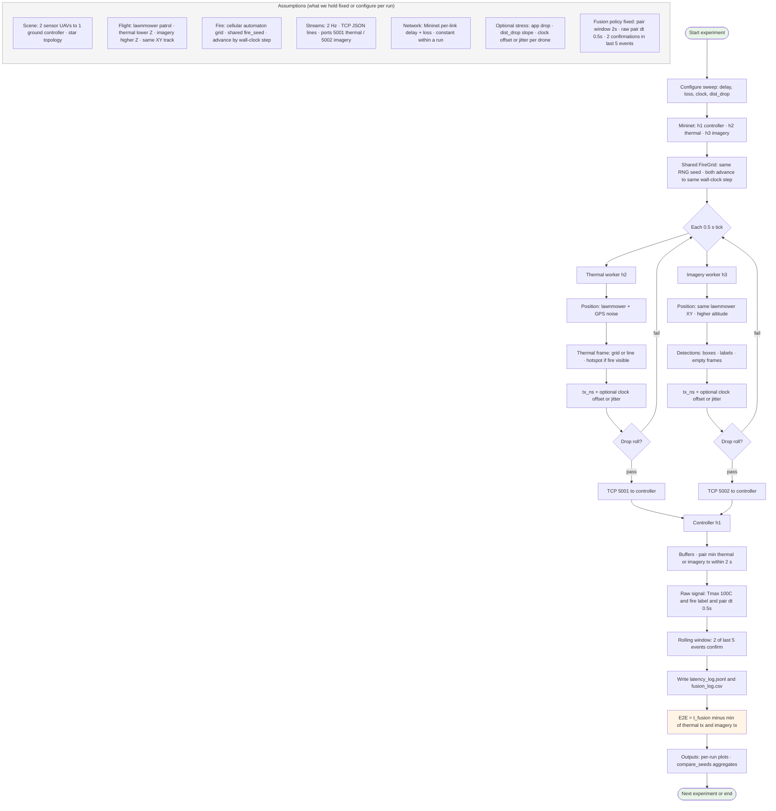
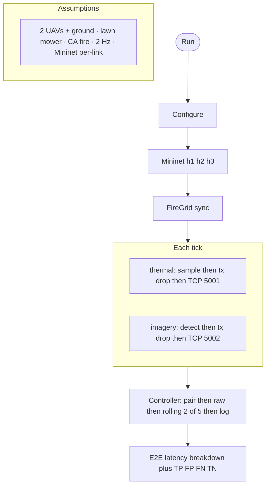

# Wildfire simulation — one-page flowchart

**How to use:** Copy the first code block into [mermaid.live](https://mermaid.live) → export **SVG** or **PNG** → paste on one slide (use **landscape**).

---

## Full diagram (assumptions + pipeline + output)



---

## Compact one-slide variant (single column)



---

## Draw.io / Lucidchart (ASCII wireframe)

```
┌─────────────────────────────────────────────────────────────────────────┐
│ ASSUMPTIONS: 2 UAVs + ground │ lawn mower │ CA fire+seed │ 2Hz │ Mininet   │
└─────────────────────────────────────────────────────────────────────────┘
                                      │
                    ┌─────────────────┴─────────────────┐
                    ▼                                   ▼
            ┌───────────────┐                   ┌───────────────┐
            │ THERMAL h2    │                   │ IMAGERY h3    │
            │ fire grid→    │                   │ fire grid→    │
            │ sample→tx→drop│                   │ detect→tx→drop│
            │ → TCP 5001    │                   │ → TCP 5002    │
            └───────┬───────┘                   └───────┬───────┘
                    │                                   │
                    └──────────────┬────────────────────┘
                                   ▼
                    ┌──────────────────────────────┐
                    │ CONTROLLER h1   pair |Δtx|≤2s │
                    │ raw → rolling 2/5 → log      │
                    └──────────────┬───────────────┘
                                   ▼
                    ┌──────────────────────────────┐
                    │ E2E = t_fusion − min(tx)     │
                    │ + TP/FP/FN/TN                │
                    └──────────────────────────────┘
```
